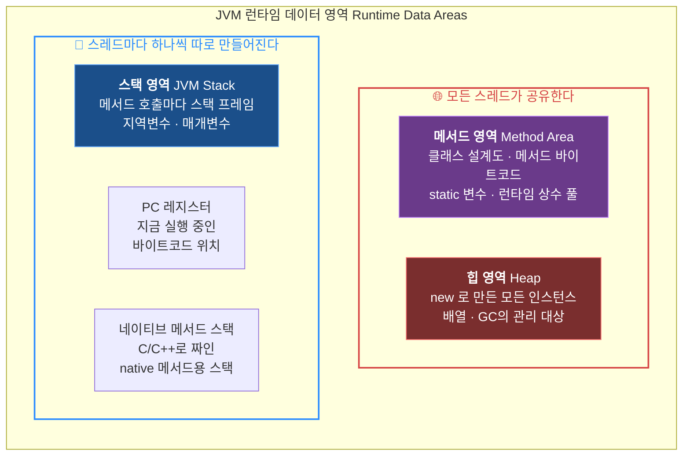
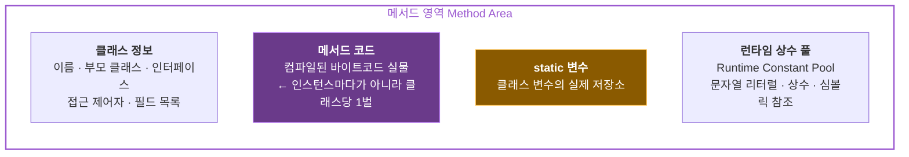
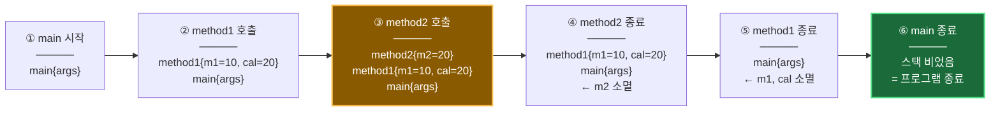
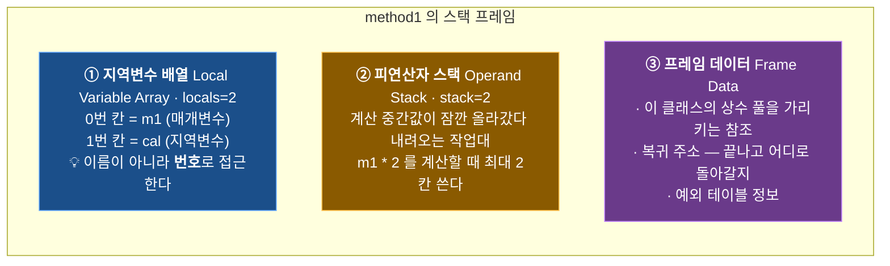
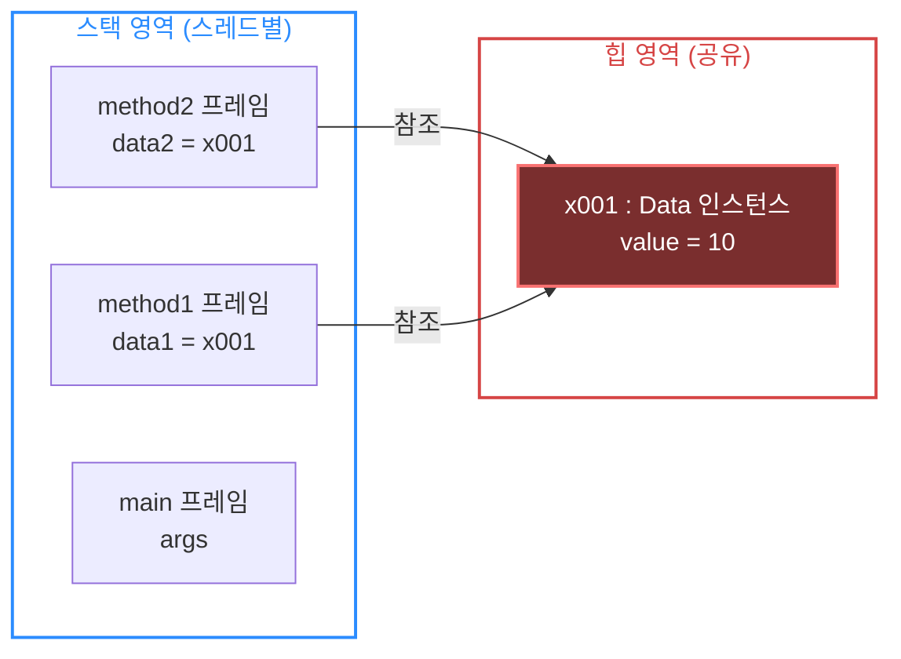
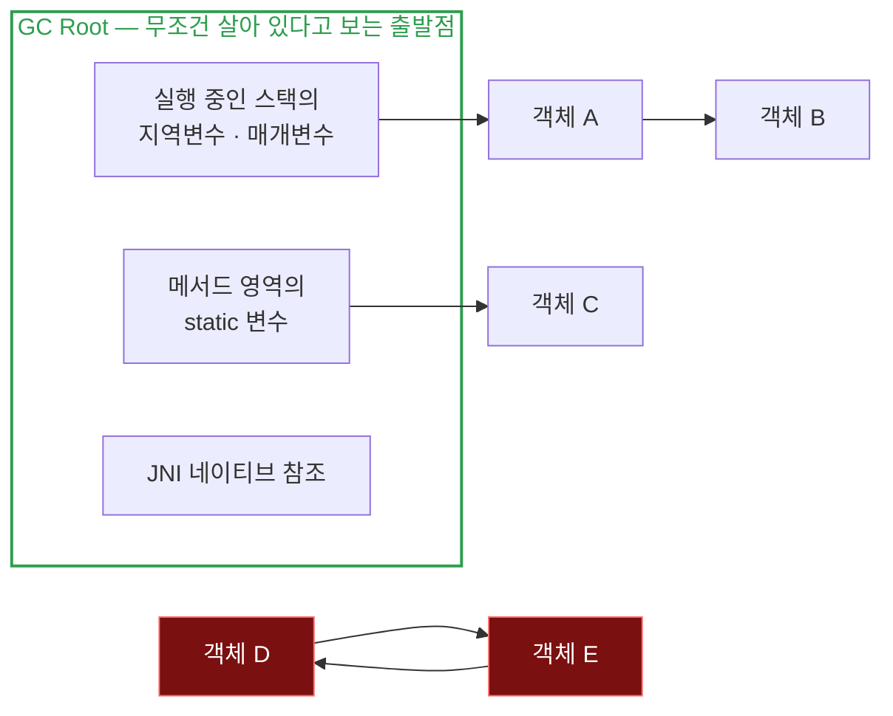
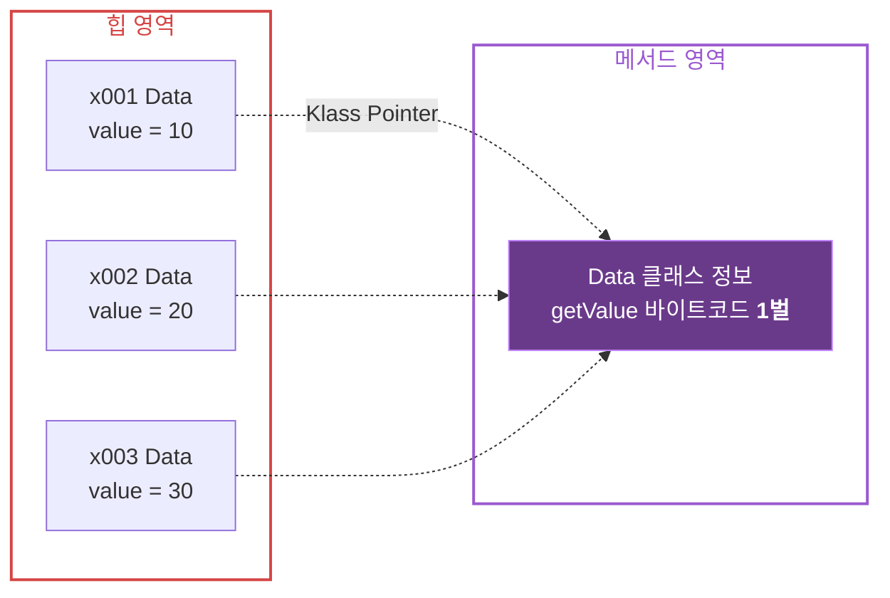
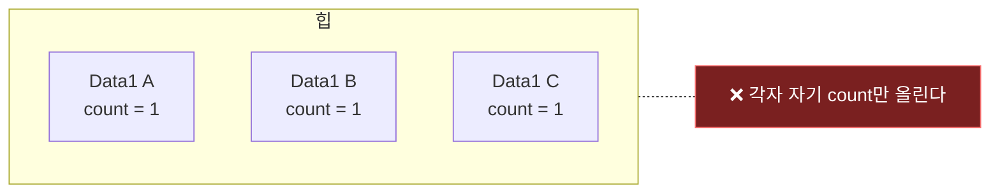
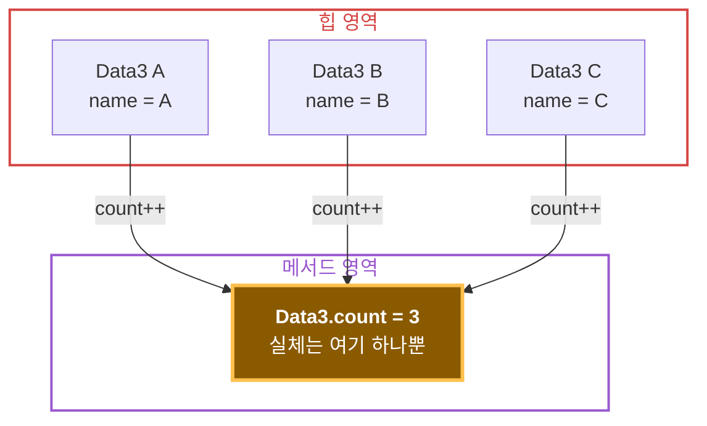
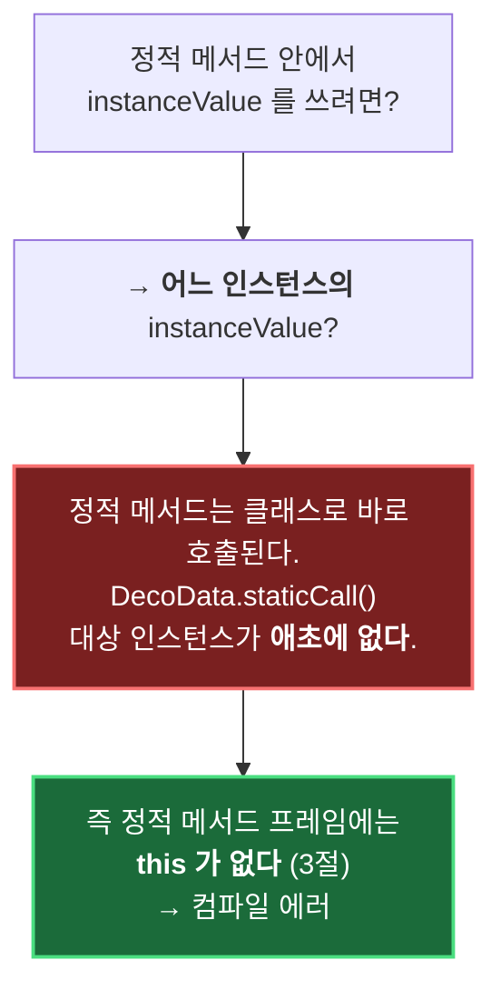

# 07. 자바 메모리 구조와 static — 어디에 저장되고, 언제까지 사는가

> 근거: 강의자료 `7. 자바 메모리 구조와 static.pdf` +
> 내가 작성한 [`memory`](../../answer/src/memory), [`static1`](../../answer/src/static1),
> [`static2`](../../answer/src/static2) 패키지
>
> 이 챕터의 질문은 두 개다.
> **① 내가 만든 변수와 객체는 정확히 어디에 저장되는가**,
> **② 인스턴스마다가 아니라 클래스 전체가 공유하는 값은 어떻게 만드는가.**
> ②의 답이 `static`이고, 그걸 이해하려면 ①이 먼저다.

---

## 이 문서를 읽는 법 — 중요도 등급

메모리 구조 부분을 **심화해서** 정리했다. 전부 외울 필요는 없고 등급을 붙여 뒀다.

| 등급 | 의미 |
|------|------|
| ⭐⭐⭐ **필수** | 모르면 자바 코드를 잘못 이해하게 된다. 시험·면접·실무에서 바로 쓰인다 |
| ⭐⭐ **권장** | 성능·메모리 문제를 만났을 때 필요하다. 개념과 용어만 익혀 두자 |
| ⭐ **심화** | JVM 구현 세부. 몰라도 코드는 잘 짜지만 알면 전체가 연결된다 |

| 절 | 주제 | 등급 |
|----|------|------|
| 1 | 메모리 구조 큰 그림 — 3개 영역 | ⭐⭐⭐ |
| 2 | 메서드 영역 심화 — Metaspace와 상수 풀 | ⭐ |
| 3 | 스택 영역 — 스택 프레임 해부 | ⭐⭐⭐ |
| 4 | 스택 + 힙 — 참조가 오가는 방식 | ⭐⭐⭐ |
| 5 | 힙 심화 — 도달 가능성과 GC | ⭐⭐ |
| 6 | 메서드 코드는 어디에 있나 | ⭐⭐ |
| 7 | static 변수 — 문제 → 개선 → 해결 | ⭐⭐⭐ |
| 8 | 변수 3종과 생명주기 | ⭐⭐⭐ |
| 9 | static 메서드 | ⭐⭐⭐ |
| 10 | static 메서드의 접근 제약 | ⭐⭐⭐ |
| 11 | static import · `main`이 static인 이유 | ⭐⭐ |
| 12 | static의 위험 — 누수와 공유 상태 | ⭐⭐ |

---

# 1부 — 자바 메모리 구조

## 1. 큰 그림 — 3개 영역 ⭐⭐⭐

자바 프로그램이 실행되면 JVM은 메모리를 용도별로 나눠서 쓴다.
강의에서는 **메서드 영역 · 스택 영역 · 힙 영역** 3개로 배우는데,
JVM 명세상으로는 5개다. 나머지 2개까지 같이 봐 두면 그림이 완성된다.



| 영역 | 무엇이 들어가나 | 공유 여부 | 언제 사라지나 |
|------|----------------|-----------|--------------|
| **메서드 영역** | 클래스 정보, 메서드 코드, `static` 변수, 상수 풀 | 전체 공유 | **프로그램 종료 시** |
| **힙 영역** | `new`로 만든 인스턴스, 배열 | 전체 공유 | **GC가 판단해서** |
| **스택 영역** | 스택 프레임(지역변수·매개변수·중간 계산값) | **스레드별** | **메서드가 끝나면 즉시** |
| PC 레지스터 | 현재 실행 중인 바이트코드 주소 | 스레드별 | 스레드 종료 시 |
| 네이티브 메서드 스택 | `native` 메서드(C/C++) 호출 정보 | 스레드별 | 스레드 종료 시 |

> 🔑 **이 표의 "언제 사라지나" 열이 핵심이다.**
> 세 영역은 저장 위치가 다른 게 아니라 **수명이 다르다.**
> 스택은 메서드 단위, 힙은 참조가 끊길 때까지, 메서드 영역은 프로그램 끝까지.
> `static`이 왜 위험할 수 있는지도 결국 이 표에서 나온다(12절).

⚠️ **스택은 "프로그램에 하나"가 아니다.** 스레드 하나당 스택 하나가 만들어진다.
스레드를 10개 띄우면 스택도 10개다. 그래서 지역변수는 스레드끼리 절대 섞이지 않고,
반대로 힙과 메서드 영역(=`static` 변수)은 공유되므로 동시성 문제가 생긴다.

---

## 2. 메서드 영역 심화 — 이름은 하나, 구현은 여러 개 ⭐

> **왜 심화인가** — 코드 짜는 데는 필요 없다. 다만 `OutOfMemoryError: Metaspace` 같은
> 에러를 만났을 때, "메서드 영역이 뭔지"를 알아야 검색이라도 할 수 있다.

### 메서드 영역에 들어가는 것



### 런타임 상수 풀이란

`javap`로 클래스 파일을 열면 `#7`, `#29` 같은 번호가 잔뜩 나온다.

```
0: getstatic     #7    // Field java/lang/System.out:Ljava/io/PrintStream;
3: ldc           #29   // String method1 start
5: invokevirtual #15   // Method java/io/PrintStream.println:(Ljava/lang/String;)V
```

바이트코드는 `"method1 start"`라는 문자열을 직접 품고 있지 않다.
**`#29`라는 번호표**만 들고 있고, 실제 값은 상수 풀이라는 표에 따로 모아 둔다.

> 💡 **왜 이렇게 하나** — 같은 문자열이 코드에 100번 나와도 상수 풀에는 **1개만** 저장된다.
> 클래스 파일 크기가 줄고, 로딩할 때 심볼릭 참조(이름표)를 실제 주소로 한 번에 바꿔치기할 수 있다.
> (→ 이 "바꿔치기"가 [부록A](./부록A.%20new%20인스턴스%20생성%20과정%20—%20JVM에서%20CPU까지.md)의 **해석 Resolution** 단계다.)

### 버전에 따라 구현 위치가 바뀌었다

"메서드 영역"은 **JVM 명세상의 논리적 이름**이고, 실제 어디에 두는지는 JVM 구현이 정한다.

| 자바 버전 | 구현 이름 | 실제 위치 | 문제 |
|----------|----------|-----------|------|
| ~ 7 | **PermGen** (Permanent Generation) | **힙 안쪽** · 크기 고정 | 클래스를 많이 로딩하면 `OutOfMemoryError: PermGen space` |
| 8 ~ | **Metaspace** | **네이티브 메모리** (힙 밖, OS에서 직접) | 기본 무제한이라 잘 안 터진다 |

> ⭐ **더 깊이 — `static` 변수는 사실 힙에 있다**
> 개념적으로는 "`static` 변수는 메서드 영역에 저장된다"고 배우고, 그렇게 이해하면 된다.
> 다만 자바 7 이후 HotSpot JVM의 실제 구현에서는 `static` 필드의 값이
> **힙에 있는 `java.lang.Class` 객체(클래스 미러) 안에** 저장된다.
> 메타스페이스에는 "설계도 정보"가 있고, 값 자체는 힙에 있는 구조다.
> **시험·강의 답으로는 "메서드 영역"이 맞다.** 이건 구현 세부라 참고만 하자.

---

## 3. 스택 영역 — 스택 프레임 해부 ⭐⭐⭐

> 내 코드: [`memory/JavaMemoryMain1.java`](../../answer/src/memory/JavaMemoryMain1.java)

```java
public static void main(String[] args) {
    System.out.println("main start");
    method1(10);
    System.out.println("main end");
}

static void method1(int m1) {
    System.out.println("method1 start");
    int cal = m1 * 2;
    method2(cal);
    System.out.println("method1 end");
}

static void method2(int m2) {
    System.out.println("method2 start");
    System.out.println("method2 end");
}
```

실행 결과가 **바깥에서 안으로, 다시 안에서 바깥으로** 대칭인 이유가 스택이다.

```
main start
method1 start
method2 start
method2 end
method1 end
main end
```

### 시간에 따른 스택 변화



> 🔑 **핵심 3가지**
> 1. 메서드를 호출하면 **스택 프레임(Stack Frame)**이 하나 쌓이고, 끝나면 즉시 제거된다.
> 2. 지역변수와 매개변수는 그 프레임 안에서 산다. **프레임이 사라지면 같이 사라진다.**
> 3. **`main`의 프레임까지 제거되면 프로그램이 끝난다.**

### 스택 프레임 안에는 정확히 뭐가 있나 ⭐

`javap -c -v`로 `method1`을 열어 보면 이런 줄이 나온다.

```
static void method1(int);
  Code:
    stack=2, locals=2, args_size=1
       0: getstatic     #7    // System.out
       3: ldc           #29   // String method1 start
       5: invokevirtual #15   // println
       8: iload_0             ← 지역변수 0번(m1)을 피연산자 스택에 올림
       9: iconst_2            ← 상수 2를 올림
      10: imul                ← 두 개를 꺼내 곱하고 결과를 올림
      11: istore_1            ← 결과를 지역변수 1번(cal)에 저장
      12: iload_1
      13: invokestatic  #31   // method2 호출
```

여기서 `stack=2, locals=2`가 **이 프레임의 설계 치수**다. 프레임은 세 부분으로 구성된다.



| 구성 요소 | 하는 일 | 확인 방법 |
|----------|---------|----------|
| 지역변수 배열 | 매개변수 + 지역변수를 **번호 칸**에 저장 | `locals=2` |
| 피연산자 스택 | 연산 중간값을 올렸다 내리는 작업 공간 | `stack=2` |
| 프레임 데이터 | 상수 풀 참조, 복귀 주소 | 바이트코드에 직접은 안 보임 |

> 💡 **지역변수는 이름으로 찾지 않는다.**
> `cal`이라는 이름은 컴파일 시점에 사라지고, 실행 중엔 `istore_1` / `iload_1`처럼
> **1번 칸**으로만 접근한다. 그래서 지역변수 접근이 압도적으로 빠르다.
> (인스턴스 필드는 힙까지 가야 하지만, 지역변수는 이미 프레임 안에 있다.)
>
> ⚠️ `static` 메서드는 0번 칸부터 매개변수가 들어가지만,
> **인스턴스 메서드는 0번 칸이 `this`**로 예약된다. 이 차이가 10절의 제약으로 이어진다.

### 스택이 넘치면 — `StackOverflowError` ⭐⭐

스택 크기는 스레드당 고정이다(보통 512KB~1MB, `-Xss` 옵션으로 조정).
재귀 호출이 끝나지 않으면 프레임이 계속 쌓여서 터진다.

```java
static void loop() {
    loop();   // 종료 조건 없음 → 프레임 무한 증식
}
// Exception in thread "main" java.lang.StackOverflowError
```

| 에러 | 터지는 영역 | 전형적 원인 |
|------|------------|-------------|
| `StackOverflowError` | **스택** | 종료 조건 없는 재귀, 너무 깊은 호출 |
| `OutOfMemoryError: Java heap space` | **힙** | 객체를 계속 만들고 참조를 안 놓음 |
| `OutOfMemoryError: Metaspace` | **메서드 영역** | 클래스를 동적으로 계속 로딩 |

> 💡 에러 이름만 보고도 **어느 영역이 터졌는지** 바로 알 수 있어야 한다.
> 위 표는 실무에서 그대로 쓰인다.

---

## 4. 스택과 힙이 함께 — 참조가 오가는 방식 ⭐⭐⭐

> 내 코드: [`memory/JavaMemoryMain2.java`](../../answer/src/memory/JavaMemoryMain2.java),
> [`memory/Data.java`](../../answer/src/memory/Data.java)

```java
static void method1() {
    System.out.println("method1 start");
    Data data1 = new Data(10);   // ← 힙에 인스턴스, 스택에 참조값
    method2(data1);              // ← 참조값이 "복사"되어 전달
    System.out.println("method1 end");
}

static void method2(Data data2) {
    System.out.println("data.value=" + data2.getValue());
}
```



### 여기서 확인할 것

1. **인스턴스는 힙에 하나뿐이다.** `method2`에 넘겨도 객체가 복제되지 않는다.
2. **복사되는 건 참조값(`x001`)이다.** 스택에는 주소만 들어간다.
   (→ [02. 기본형과 참조형](./02.%20기본형과%20참조형.md)에서 본 그 내용이 메모리 그림으로 확인된다.)
3. `method1`이 끝나면 `data1`이 사라지고, `Data` 인스턴스를 **아무도 참조하지 않게 된다.**
   그 순간 GC의 회수 대상이 된다.

바이트코드로 보면 3번이 더 명확하다.

```
 8: new           #30   // class memory/Data   ← 힙에 자리 확보
11: dup
12: bipush        10
14: invokespecial #32   // Data.<init>(int)    ← 생성자 실행
17: astore_0                                   ← 참조값을 지역변수 0번(data1)에
18: aload_0                                    ← 다시 꺼내서
19: invokestatic  #35   // method2(Data)       ← 매개변수로 전달 (값 = 참조값 복사)
```

> ⚠️ **"참조를 전달한다"와 "객체를 전달한다"는 다르다.**
> 자바는 항상 **값 전달(pass by value)**이고, 참조형에서는 그 "값"이 참조값일 뿐이다.
> 그래서 `method2` 안에서 `data2 = new Data(99);`를 해도 `data1`은 안 바뀐다.
> 반대로 `data2.setValue(99)`는 같은 인스턴스를 건드리므로 `data1`에도 반영된다.

---

## 5. 힙 심화 — 누가 살고 누가 죽는가 ⭐⭐

> **왜 권장인가** — GC 튜닝까지는 몰라도 된다. 다만 "언제 객체가 사라지는가"는
> 메모리 누수를 이해하는 출발점이고, 12절의 `static` 주의사항과 직결된다.

### GC가 판단하는 기준은 "도달 가능성 Reachability"

참조 카운트가 아니다. **GC Root에서 시작해 참조를 따라갔을 때 닿는가**로 판단한다.



> 🔑 **D와 E는 서로를 참조하지만 둘 다 회수된다.**
> 루트에서 닿지 않기 때문이다. 참조 카운트 방식이라면 순환 참조가 영원히 안 지워지는데,
> 자바는 도달 가능성으로 판단해서 이 문제가 없다.
>
> ⚠️ 반대로 **`static` 변수는 그 자체가 GC Root**다. `static`에 매달아 둔 객체는
> 프로그램이 끝날 때까지 절대 회수되지 않는다. 12절에서 다시 본다.

### 힙 내부 구조 — 세대 구분


| GC 종류 | 대상 | 속도 | 빈도 |
|---------|------|------|------|
| **Minor GC** | Young 영역만 | 빠름 (ms) | 자주 |
| **Major / Full GC** | Old 영역 포함 전체 | 느림 (수백 ms~) | 드물게 |

> 💡 **약한 세대 가설(Weak Generational Hypothesis)** — "대부분의 객체는 금방 죽는다."
> 실제로 `method1` 안에서 만든 `Data`처럼 대부분의 객체는 메서드가 끝나면 바로 쓰레기가 된다.
> 그래서 새 객체만 모아 둔 Eden을 자주, 싸게 청소하는 전략이 통한다.
>
> ⚠️ `System.gc()`는 **호출하지 말 것.** "해 주면 좋겠다"는 요청일 뿐 보장이 없고,
> 오히려 Full GC를 유발해 성능을 망친다.

---

## 6. 메서드 코드는 어디에 있나 ⭐⭐

자주 헷갈리는 지점이다. 인스턴스를 100개 만들면 메서드 코드도 100벌일까?



> 🔑 **인스턴스에는 "필드 값"만 들어간다. 메서드 코드는 메서드 영역에 클래스당 1벌뿐이다.**
> `data1.getValue()`를 호출하면 JVM은 `data1`이 가리키는 인스턴스의
> 클래스 포인터를 따라가 메서드 영역의 코드를 실행한다.
> 이때 "어느 인스턴스에 대해 실행하는가"를 알려 주는 게 **`this`**이고,
> 그래서 인스턴스 메서드 프레임의 지역변수 0번 칸이 `this`로 예약되는 것이다(3절).
>
> 인스턴스마다 코드를 복사한다면 객체 100만 개에 메서드 코드 100만 벌이 될 텐데,
> 당연히 그렇게 하지 않는다.

---

# 2부 — static

## 7. static 변수 — 문제 → 개선 → 해결 ⭐⭐⭐

> 내 코드: [`static1`](../../answer/src/static1) 패키지
> **요구사항: `Data` 인스턴스가 몇 개 생성되었는지 세어라.**

### ① 인스턴스 변수로 시도 — 실패

```java
// static1/Data1.java
public class Data1 {
    public String name;
    public int count;          // 인스턴스 변수

    public Data1(String name) {
        this.name = name;
        count++;
    }
}
```

```
기대: 1, 2, 3
실제: 1, 1, 1     ← 전부 1
```

**인스턴스 변수는 인스턴스마다 새로 만들어진다.** 새 객체가 태어날 때마다
`count`도 새로 0에서 시작하니 아무리 더해도 1이다.



### ② 카운터 인스턴스를 공유 — 동작하지만 번거롭다

```java
// static1/Data2.java
public class Data2 {
    public String name;

    public Data2(String name, Counter counter) {   // 외부에서 카운터를 받는다
        this.name = name;
        counter.count++;
    }
}
```

```java
Counter counter = new Counter();          // 공용 카운터 1개
Data2 data1 = new Data2("A", counter);    // 1
Data2 data2 = new Data2("B", counter);    // 2
Data2 data3 = new Data2("C", counter);    // 3
```

값 공유에는 성공했다. 하지만 **`Data2`를 만들 때마다 `Counter`를 들고 다녀야 하고,
사용하는 쪽이 카운터 인스턴스를 직접 관리해야 한다.** 실수하기 쉬운 구조다.

### ③ static 변수 — 해결

```java
// static1/Data3.java
public class Data3 {
    public String name;
    public static int count;   // ← static 하나 붙였을 뿐

    public Data3(String name) {
        this.name = name;
        count++;
    }
}
```

```
A count=1
B count=2
C count=3
```

`static`이 붙은 변수는 **인스턴스가 아니라 클래스에 소속된다.**
인스턴스를 몇 개 만들든 실체는 **메서드 영역에 딱 하나**다.



> 💡 `name`은 인스턴스마다 달라야 하니 인스턴스 변수, `count`는 전체가 공유해야 하니 정적 변수.
> **"이 값이 인스턴스마다 달라야 하는가, 클래스 전체에 하나여야 하는가"**가 판단 기준이다.

### 접근 방법 — 클래스로 접근한다

```java
// static1/DataCountMain3.java
Data3 data4 = new Data3("D");

System.out.println(data4.count);   // ⚠️ 인스턴스로 접근 — 가능하지만 권장하지 않음
System.out.println(Data3.count);   // ✅ 클래스로 접근 — 이 방식을 쓴다
```

⚠️ 인스턴스로도 접근이 되긴 하지만, **마치 인스턴스 변수처럼 보여서 오해를 부른다.**
`Data3.count`라고 써야 "아, 이건 클래스에 하나뿐인 값이구나"가 코드에 드러난다.
(참고로 `data4.count`는 컴파일되면 어차피 `Data3.count`로 바뀐다.)

### static 변수는 언제 초기화되나 ⭐

```java
public static int count;        // 클래스 로딩의 "준비" 단계에서 0
public static int max = 10;     // 클래스 로딩의 "초기화" 단계에서 10
```

`static` 변수는 **인스턴스를 하나도 안 만들어도** 클래스가 로딩되는 순간 이미 존재한다.
그래서 `new` 없이 `Data3.count`를 읽을 수 있다.
자세한 로딩 단계는 → [부록A · 5절 클래스 로딩](./부록A.%20new%20인스턴스%20생성%20과정%20—%20JVM에서%20CPU까지.md)

> 💡 초기화 로직이 복잡하면 **`static` 초기화 블록**을 쓸 수 있다. 클래스 로딩 시 한 번만 실행된다.
> ```java
> public static int[] table;
> static {                       // static 초기화 블록
>     table = new int[10];
>     for (int i = 0; i < 10; i++) table[i] = i * i;
> }
> ```

---

## 8. 변수 3종과 생명주기 ⭐⭐⭐

용어가 여러 개라 헷갈린다. 한 표로 정리한다.

| 종류 | 다른 이름 | 선언 위치 | 저장 영역 | 생명주기 | 개수 |
|------|----------|----------|-----------|----------|------|
| **지역 변수** | 로컬 변수 | 메서드 안 | **스택** | 메서드 종료 시 소멸 | 호출마다 |
| **인스턴스 변수** | 멤버 변수, 필드 | 클래스 안 (`static` 없음) | **힙** | 인스턴스가 GC될 때까지 | 인스턴스마다 |
| **클래스 변수** | **정적 변수**, **static 변수** | 클래스 안 (`static` 있음) | **메서드 영역** | **프로그램 종료까지** | **클래스당 1개** |

```java
public class Example {
    int instanceVar;             // 인스턴스 변수 → 힙
    static int classVar;         // 클래스 변수 → 메서드 영역

    void method(int paramVar) {  // 매개변수 → 스택
        int localVar = 0;        // 지역 변수 → 스택
    }
}
```


> 🔑 **생명주기가 곧 메모리 영역이다.** 셋의 차이를 "어디 선언했나"로 외우지 말고
> **"언제까지 살아야 하는 값인가"**로 이해하면 자연스럽게 정리된다.

---

## 9. static 메서드 ⭐⭐⭐

> 내 코드: [`static2/DecoUtil1.java`](../../answer/src/static2/DecoUtil1.java),
> [`static2/DecoUtil2.java`](../../answer/src/static2/DecoUtil2.java)

문자열 앞뒤에 `*`를 붙이는 기능이다. 상태(필드)가 전혀 필요 없다.

### 인스턴스 메서드로 만들면

```java
public class DecoUtil1 {
    public String deco(String str) {
        return "*" + str + "*";
    }
}
```
```java
DecoUtil1 utils = new DecoUtil1();   // ⚠️ 아무 상태도 없는데 인스턴스를 만들어야 한다
String deco = utils.deco(s);
```

### 정적 메서드로 만들면

```java
public class DecoUtil2 {
    public static String deco(String str) {
        return "*" + str + "*";
    }
}
```
```java
String deco = DecoUtil2.deco(s);     // ✅ 인스턴스 없이 클래스로 바로 호출
```

> 🔑 **판단 기준: 이 메서드가 인스턴스의 상태(필드)를 쓰는가?**
> - 쓴다 → **인스턴스 메서드**
> - 안 쓴다, 매개변수만으로 결과가 나온다 → **정적 메서드**
>
> `Math.max()`, `Integer.parseInt()` 같은 자바 표준 라이브러리의 유틸리티가 전부 이 형태다.

💡 이렇게 정적 메서드만 모아 놓은 클래스는 **인스턴스를 만들 이유가 없으므로**
생성자를 `private`으로 막는 게 좋은 설계다. (`Math` 클래스가 실제로 그렇게 되어 있다.)

```java
public class MathArrayUtils {
    private MathArrayUtils() {  // 인스턴스 생성을 막는다
    }
    public static int sum(int[] values) { ... }
}
```

---

## 10. static 메서드의 접근 제약 ⭐⭐⭐

> 내 코드: [`static2/DecoData.java`](../../answer/src/static2/DecoData.java)

```java
public class DecoData {
    private int instanceValue;
    private static int staticValue;

    public static void staticCall() {
        // instanceValue++;   // ❌ compile error
        // instanceMethod();  // ❌ compile error
        staticValue++;        // ✅
        staticMethod();       // ✅
    }

    public void instanceCall() {
        instanceValue++;      // ✅
        instanceMethod();     // ✅
        staticValue++;        // ✅
        staticMethod();       // ✅
    }
}
```

| 호출하는 쪽 | 정적 변수/메서드 | 인스턴스 변수/메서드 |
|------------|-----------------|---------------------|
| **정적 메서드** | ✅ 가능 | ❌ **불가능** |
| 인스턴스 메서드 | ✅ 가능 | ✅ 가능 |

### 왜 안 되는가 — 6절과 3절이 답이다



> 🔑 **한 문장 요약: 정적 메서드에는 `this`가 없다.**
> 인스턴스 변수 접근은 사실 `this.instanceValue`인데, `this`가 없으니 불가능하다.
> 반대로 정적 변수는 클래스에 딱 하나라 대상이 명확하므로 어디서든 접근할 수 있다.
>
> 💡 정적 메서드에서 인스턴스 멤버를 꼭 써야 한다면 **매개변수로 인스턴스를 받으면 된다.**
> ```java
> public static void print(DecoData data) {
>     data.instanceCall();   // 대상이 명시되었으므로 가능
> }
> ```

⚠️ **정적 메서드도 인스턴스로 호출은 된다.**

```java
DecoData data3 = new DecoData();
data3.staticCall();      // ⚠️ 되지만 쓰지 말 것 — 인스턴스 메서드처럼 보인다
DecoData.staticCall();   // ✅
```

---

## 11. static import · `main`이 static인 이유 ⭐⭐

### static import

정적 메서드를 자주 쓸 때 클래스 이름을 생략할 수 있다.

```java
import static java.lang.Math.max;   // 특정 멤버만
import static java.lang.Math.*;     // 전부

int result = max(10, 20);           // Math.max(10, 20) 대신
```

> ⚠️ 남용하면 **이 메서드가 어느 클래스 것인지 알 수 없어져** 가독성이 떨어진다.
> 같은 이름의 메서드가 여러 곳에 있으면 충돌도 난다. 정말 자주 쓰는 경우에만 쓰자.

### `main`은 왜 `static`인가

```java
public static void main(String[] args) { ... }
```

프로그램이 시작되는 시점에는 **아직 아무 인스턴스도 없다.**
JVM이 `main`을 부르려면 인스턴스 없이 호출할 수 있어야 하므로 반드시 `static`이어야 한다.

> ⚠️ 그래서 **`main` 안에서 그 클래스의 인스턴스 변수/메서드를 바로 쓸 수 없다.**
> 초보자가 가장 자주 만나는 컴파일 에러가 이것이다.
> ```java
> public class Hello {
>     int value = 10;
>     public static void main(String[] args) {
>         System.out.println(value);        // ❌ non-static variable cannot be referenced
>         System.out.println(new Hello().value);  // ✅ 인스턴스를 만들어서 접근
>     }
> }
> ```

---

## 12. static의 위험 — 누수와 공유 상태 ⭐⭐

`static`은 편하지만 **가장 오래 살고 모두가 공유하는** 변수다. 대가가 있다.

| 위험 | 왜 생기나 | 대응 |
|------|----------|------|
| **메모리 누수** | `static` 변수는 GC Root(5절). 여기 매달린 객체는 프로그램 끝까지 회수 안 됨 | `static` 컬렉션에 계속 `add`하지 말 것 |
| **동시성 문제** | 메서드 영역은 모든 스레드가 공유(1절). `count++`는 원자적이지 않다 | 가급적 상태를 `static`으로 두지 말 것 |
| **테스트 어려움** | 이전 테스트가 바꾼 값이 다음 테스트에 남는다 | 상태는 인스턴스에 두기 |
| **결합도 상승** | 어디서든 접근 가능 = 어디서 바꿨는지 추적 불가 | 필요한 곳에 주입해서 쓰기 |

```java
public class Cache {
    private static Map<String, Data> cache = new HashMap<>();  // ⚠️ 영원히 안 지워진다
    public static void put(String key, Data d) { cache.put(key, d); }
}
```

> 🔑 **결론: `static`은 "상태 없는 유틸리티"와 "진짜로 클래스 전체가 공유해야 하는 값"에만 쓴다.**
> - ✅ 좋은 예: `Math.max()`, 인스턴스 생성 카운터, `static final` 상수
> - ❌ 나쁜 예: 사용자 정보, 진행 중인 작업 상태, 캐시를 무한정 담는 `static` 컬렉션
>
> 💡 값이 바뀌지 않는 상수라면 `static final`로 선언한다.
> 공유해도 안전하고 의도도 명확해진다. → [08. final](./08.%20final.md)

---

## ✅ 핵심 요약

### ⭐⭐⭐ 이것만은 반드시

1. **메모리 영역 3개는 수명이 다르다.**
   스택 = 메서드 끝나면 즉시, 힙 = GC가 판단할 때, 메서드 영역 = 프로그램 종료 시.
2. **스택은 스레드마다 하나씩**이고, 힙과 메서드 영역은 **모든 스레드가 공유**한다.
3. **메서드 호출 = 스택 프레임 하나 쌓기.** 지역변수·매개변수는 그 안에 살다가 같이 사라진다.
   `main` 프레임이 사라지면 프로그램이 끝난다.
4. **인스턴스는 힙에, 참조값은 스택에.** 메서드에 넘길 때 복사되는 것은 **참조값**이다.
5. **`static` 변수 = 클래스당 1개, 메서드 영역에 저장, 프로그램 종료까지 생존.**
   인스턴스가 없어도 존재한다.
6. **정적 메서드에는 `this`가 없다.** 그래서 인스턴스 변수·메서드에 접근할 수 없다.
7. **정적 멤버는 클래스로 접근한다.** `Data3.count`, `DecoUtil2.deco()`.

### ⭐⭐ 알아 두면 좋은 것

8. 메서드 코드는 **클래스당 1벌**만 메서드 영역에 있다. 인스턴스에는 필드 값만 있다.
9. `StackOverflowError`(스택) / `OutOfMemoryError: heap`(힙) / `Metaspace`(메서드 영역) —
   에러 이름으로 어느 영역이 터졌는지 알 수 있다.
10. GC는 **도달 가능성**으로 판단한다. 순환 참조도 루트에서 안 닿으면 회수된다.
    반대로 **`static`은 GC Root라 매달린 객체가 안 죽는다.**

### ⭐ 심화

11. 메서드 영역의 구현은 자바 7까지 **PermGen**(힙 내부), 8부터 **Metaspace**(네이티브 메모리).
12. 스택 프레임 = **지역변수 배열 + 피연산자 스택 + 프레임 데이터**.
    지역변수는 이름이 아니라 **번호 칸**으로 접근한다. 인스턴스 메서드는 0번이 `this`.
13. HotSpot 구현에서 `static` 필드 값은 실제로 힙의 `Class` 객체에 저장된다.
    (개념 정리·시험 답은 "메서드 영역"이 맞다.)

### 판단 기준 한 장

| 상황 | 선택 |
|------|------|
| 인스턴스마다 값이 달라야 한다 | 인스턴스 변수 |
| 클래스 전체가 값 하나를 공유해야 한다 | **정적 변수** |
| 메서드가 인스턴스 필드를 쓴다 | 인스턴스 메서드 |
| 매개변수만으로 결과가 나온다 | **정적 메서드** |
| 값이 절대 안 바뀐다 | `static final` 상수 |

---

## 관련 정리

- [02. 기본형과 참조형](./02.%20기본형과%20참조형.md) — 참조값 복사, 스택과 힙의 관계
- [04. 생성자](./04.%20생성자.md) — `new` 직후 필드 초기화 시점
- [06. 접근 제어자](./06.%20접근%20제어자.md) — `private static`으로 공유 상태 감싸기
- [08. final](./08.%20final.md) — `static final` 상수
- [부록A. `new` 인스턴스 생성 과정 — JVM에서 CPU까지](./부록A.%20new%20인스턴스%20생성%20과정%20—%20JVM에서%20CPU까지.md)
  — 클래스 로딩·힙 할당·JIT까지 이 문서의 배경 지식
