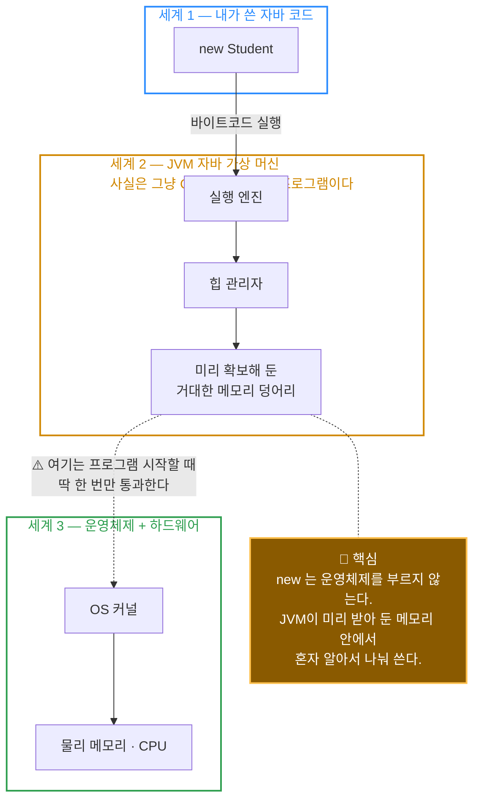
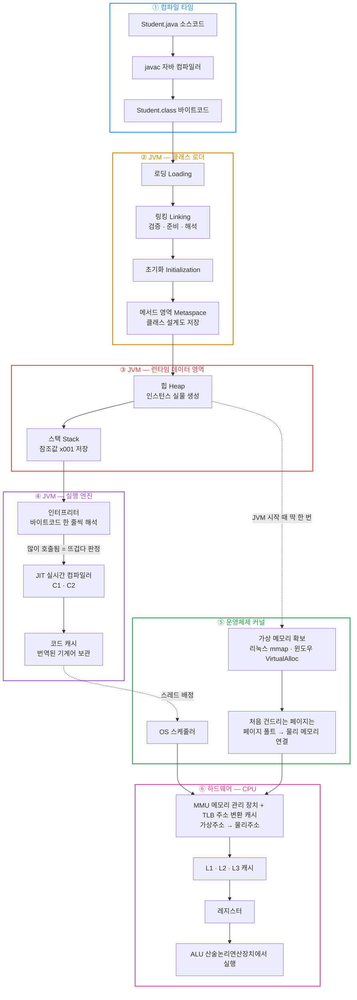
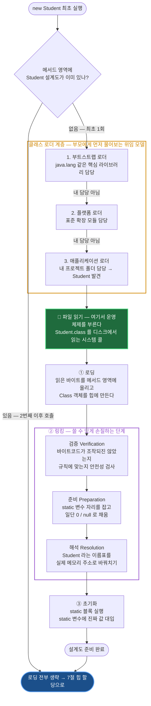
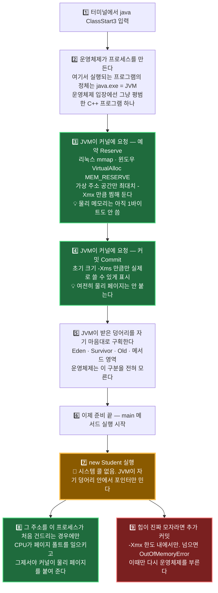
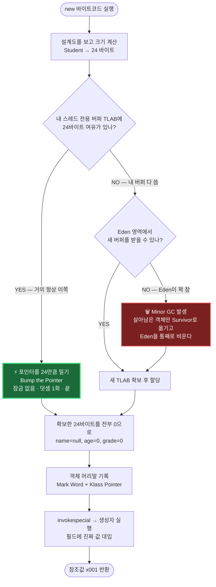
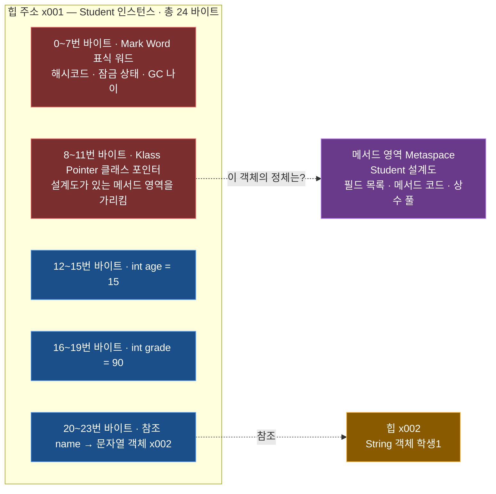
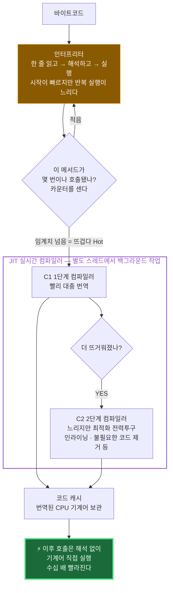
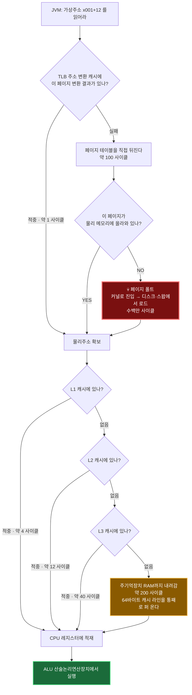

# 부록A. `new` 인스턴스 생성 과정 — JVM에서 CPU까지

> 근거: 내가 작성한 [`basic/answer/src/class1/ClassStart3.java`](../../answer/src/class1/ClassStart3.java),
> [`basic/answer/src/class1/Student.java`](../../answer/src/class1/Student.java)
>
> `Student student1 = new Student();` 한 줄이 **컴파일 → 클래스 로딩 → 힙 할당 → 실행 엔진 → 운영체제 → CPU**까지
> 어떤 경로로 흘러가는지 정리한 문서. 챕터 순번과 무관한 **독립 부록**이며,
> [07. 자바 메모리 구조와 static](./07.%20자바%20메모리%20구조와%20static.md)의 배경 지식에 해당한다.

내가 `class1`에서 작성한 클래스를 그대로 예제로 쓴다.

```java
// class1/Student.java
public class Student {
    String name;
    int age;
    int grade;
}

// class1/ClassStart3.java
Student student1;
student1 = new Student();   // ← 이 한 줄을 추적한다
student1.name = "학생1";
student1.age = 15;
student1.grade = 90;
```

---

## 이 문서를 읽는 법 — 중요도 등급

내용을 전부 외울 필요는 없다. 섹션마다 등급을 붙여 뒀다.

| 등급 | 의미 | 대응 |
|------|------|------|
| ⭐⭐⭐ **필수** | 모르면 자바 코드를 잘못 이해하게 되는 것. 면접·실무에서 바로 쓰인다 | 반드시 이해하고 넘어간다 |
| ⭐⭐ **권장** | 성능·메모리 문제를 만났을 때 필요. 지금 당장은 아니어도 언젠가 쓴다 | 개념과 용어만 익혀 둔다 |
| ⭐ **교양** | 컴퓨터구조·운영체제 영역. 자바를 쓰는 데 몰라도 되지만 알면 전체가 연결된다 | 편하게 읽고 넘어간다 |

**요약하면 이렇다.**

| 섹션 | 주제 | 등급 |
|------|------|------|
| 2 | 3개의 세계 — 누가 누구에게 요청하나 | ⭐⭐⭐ |
| 4 | 컴파일 — `new`가 4개 명령어로 쪼개진다 | ⭐⭐⭐ |
| 5 | 클래스 로딩 | ⭐⭐ |
| 6 | **JVM이 운영체제에게서 힙을 얻는 과정** | ⭐⭐⭐ |
| 7 | 힙 할당 — TLAB | ⭐⭐ |
| 8 | 객체 메모리 레이아웃 | ⭐ |
| 9 | 실행 엔진 — 인터프리터와 JIT | ⭐⭐ |
| 10 | **CPU 사이클이란 무엇인가** | ⭐ |
| 11 | 메모리 계층 | ⭐ |

---

## 1. 용어 사전 — 약어 전부 풀기

먼저 이 문서에 나오는 약어를 다 풀어 둔다. 뒤에서는 이 표를 안 봐도 되게 매번 병기한다.

### JVM 쪽 용어

| 약어 | 원어 | 우리말 | 한 줄 설명 |
|------|------|--------|-----------|
| **JVM** | Java **V**irtual **M**achine | 자바 가상 머신 | `.class` 파일을 읽어서 실행해 주는 프로그램. `java.exe`가 곧 JVM이다 |
| **JRE** | Java **R**untime **E**nvironment | 자바 실행 환경 | JVM + 표준 라이브러리. "자바 프로그램을 돌리는 데 필요한 최소 세트" |
| **JDK** | Java **D**evelopment **K**it | 자바 개발 키트 | JRE + 개발 도구(`javac`, `javap` 등). 개발자가 설치하는 것 |
| **JIT** | **J**ust-**I**n-**T**ime compiler | 실시간 컴파일러 | 실행 도중에 자주 쓰이는 부분만 골라 기계어로 번역하는 JVM 내부 부품 |
| **C1 / C2** | **C**ompiler level **1** / **2** | 1단계 / 2단계 컴파일러 | JIT의 두 종류. C1은 "빨리 대충", C2는 "느리지만 최적화 빡세게" |
| **GC** | **G**arbage **C**ollector | 쓰레기 수집기 | 아무도 참조하지 않는 객체를 힙에서 자동으로 치워 주는 부품 |
| **TLAB** | **T**hread-**L**ocal **A**llocation **B**uffer | 스레드 전용 할당 버퍼 | 각 스레드가 힙에서 미리 떼어 받은 개인 전용 할당 공간 |
| **Metaspace** | — | 메타스페이스 | 클래스의 "설계도 정보"가 저장되는 영역. 자바 8부터 이 이름 (이전엔 PermGen) |
| **OOP** ⚠️ | **O**rdinary **O**bject **P**ointer | 일반 객체 포인터 | 객체를 가리키는 참조값. **객체지향(Object-Oriented Programming)의 OOP와 완전히 다른 약어다** |
| **Eden / Survivor / Old** | — | 에덴 / 생존 / 노년 영역 | 힙 안의 구역들. 새 객체는 Eden에서 태어나 살아남으면 Survivor → Old로 승격 |
| **Mark Word** | — | 표식 워드 | 모든 객체 앞에 붙는 8바이트 관리 정보 (해시코드·잠금 상태·GC 나이) |
| **Klass Pointer** | **Klass** = Class의 JVM 내부 표기 | 클래스 포인터 | "이 객체는 `Student`다"를 알려 주는, 설계도를 가리키는 포인터 |

### 운영체제 · 하드웨어 쪽 용어

| 약어 | 원어 | 우리말 | 한 줄 설명 |
|------|------|--------|-----------|
| **OS** | **O**perating **S**ystem | 운영체제 | 윈도우, 리눅스, macOS. 메모리와 CPU를 프로그램들에 나눠 주는 관리자 |
| **CPU** | **C**entral **P**rocessing **U**nit | 중앙처리장치 | 실제로 계산을 하는 칩 |
| **ALU** | **A**rithmetic **L**ogic **U**nit | 산술논리연산장치 | CPU 안에서 덧셈·비교 같은 실제 연산을 담당하는 부분 |
| **MMU** | **M**emory **M**anagement **U**nit | 메모리 관리 장치 | CPU 안의 부품. 가상주소를 물리주소로 바꿔 준다 |
| **TLB** | **T**ranslation **L**ookaside **B**uffer | 주소 변환 캐시 | MMU가 최근 변환 결과를 저장해 두는 작은 캐시 |
| **RAM / DRAM** | (**D**ynamic) **R**andom **A**ccess **M**emory | 주기억장치 | 흔히 말하는 "메모리 16GB"의 그 메모리 |
| **L1 / L2 / L3** | **L**evel 1 / 2 / 3 cache | 1·2·3차 캐시 | CPU와 RAM 사이의 초고속 임시 저장소. 숫자가 클수록 크고 느리다 |
| **mmap** | **m**emory **map** | 메모리 매핑 | 리눅스 시스템 콜. "이만큼 주소 공간을 나한테 달라"고 커널에 요청 |
| **VirtualAlloc** | — | — | 윈도우의 `mmap` 대응 API. 하는 일은 같다 |
| **시스템 콜** | system call | 시스템 호출 | 일반 프로그램이 운영체제 커널에게 일을 시키는 공식 창구 |
| **페이지** | page | 페이지 | 운영체제가 메모리를 관리하는 단위 덩어리. 보통 4KB |

> ⚠️ 표에서 **OOP만 주의**하자. 자바 공부하며 나오는 OOP(객체지향)와, JVM 내부의 OOP(객체 포인터)는
> 철자만 같고 전혀 다른 말이다. 이 문서에서 OOP라고 쓰면 **후자**다.

---

## 2. 큰 그림 — 3개의 세계 ⭐⭐⭐

가장 먼저 잡아야 할 그림이다. 여기만 이해해도 절반은 끝난다.



### 여기서 반드시 깨야 하는 오해

| 흔한 오해 | 실제 |
|-----------|------|
| "`new` 하면 운영체제가 메모리를 준다" | ❌ **아니다.** JVM이 시작할 때 운영체제에서 큰 덩어리를 **한 번에** 받아 두고, 이후 `new`는 그 안에서 JVM이 혼자 처리한다 |
| "`new` 는 무거운 작업이다" | ❌ 대부분의 경우 **포인터 덧셈 한 번**이다. C 언어의 `malloc`보다 빠른 경우도 흔하다 |
| "클래스 로더가 힙에 객체를 만든다" | ❌ 로더는 **설계도**를 메서드 영역에 올릴 뿐이다. 실물을 힙에 찍는 건 `new` 명령어의 일이다 |
| "JVM은 하드웨어다 / 특별한 무언가다" | ❌ 그냥 **여러분 PC에 설치된 하나의 프로그램**이다. 작업 관리자에서 `java.exe`로 보인다 |

**클래스 로더와 힙 할당의 관계**를 한 줄로 정리하면:

> 🏭 **클래스 로더 = 공장에 설계도를 걸어 놓는 일** (클래스당 딱 1번, 파일을 읽으므로 운영체제를 부른다)
> 🔨 **`new` = 그 설계도를 보고 제품을 찍어 내는 일** (호출할 때마다, 운영체제를 안 부른다)

---

## 3. 전체 흐름 — 한 장으로



---

## 4. 컴파일 — `new` 한 줄이 4개 명령어로 ⭐⭐⭐

> **왜 필수인가** — "`new`가 생성자를 호출한다"는 오해를 여기서 깬다.
> 생성자 챕터, `this()` 호출 규칙, 불변 객체 설계까지 전부 이 구조 위에 얹힌다.

`javap -c ClassStart3.class`로 바이트코드를 직접 열어 보면:

```
 0: new           #2   // class class1/Student   ← ① 힙에 빈 메모리만 확보
 3: dup                                          ← ② 참조값 복제
 4: invokespecial #3   // Student."<init>":()V   ← ③ 생성자 실행
 7: astore_1                                     ← ④ 참조값을 지역변수 1번에 저장
```

| 명령어 | 읽는 법 | 하는 일 |
|--------|---------|---------|
| `new` | 뉴 | 힙에 크기만큼 자리를 잡고 전부 0으로 채운다. **생성자는 안 부른다** |
| `dup` | **dup**licate, 듀프 | 스택 맨 위의 값을 하나 더 복제한다 |
| `invokespecial` | 인보크스페셜 | 생성자·`private` 메서드처럼 "덮어쓰기 불가능한" 메서드를 호출한다 |
| `astore_1` | **a**ddress **store**, 에이스토어 | 참조값(address)을 지역변수 1번 칸에 저장한다 |

> 💡 **`new` 명령어는 "생성"이 아니라 "메모리 확보"까지만 한다.**
> 그래서 `new` 직후의 객체는 `name = null, age = 0, grade = 0`인 껍데기 상태다.
> 생성자는 그다음 `invokespecial`이 별도로 호출한다.

### 왜 `dup`이 필요한가


생성자는 "내가 초기화할 대상이 누구인가"를 알아야 하므로 **스택에서 참조값을 꺼내 소비한다.**
미리 `dup`으로 복제해 두지 않으면 생성자가 끝난 뒤 스택이 비어서, `astore_1`이 저장할 참조값이 없어진다.

---

## 5. 클래스 로딩 — 첫 `new` 때 딱 한 번 ⭐⭐

> **왜 권장인가** — `static` 초기화 시점, `ClassNotFoundException`,
> 스프링 같은 프레임워크의 동작 원리가 전부 여기서 나온다. 다만 지금 당장 코드를 짜는 데는 필요 없다.

`Student` 클래스를 **처음 쓰는 순간**에만 일어난다.
두 번째 `new Student()`부터는 이 단계 전체를 건너뛴다.



⚠️ **준비(Preparation)와 초기화(Initialization)를 헷갈리지 말 것**

`static int count = 10;` 이라고 썼다면

| 단계 | `count`의 값 |
|------|-------------|
| 준비 Preparation | `0` ← 자리만 잡고 기본값 |
| 초기화 Initialization | `10` ← 이제야 내가 쓴 값 |

이 두 단계 사이에 다른 스레드가 `count`를 읽으면 `0`이 나온다. 클래스 초기화 관련 버그의 단골 원인이다.

> 💡 **클래스 로딩이 운영체제를 부르는 유일한 지점**은 위 그림의 초록색 "파일 읽기" 박스다.
> `.class` 파일을 디스크에서 읽어야 하니 파일 입출력 시스템 콜이 필요하다.
> 그 이후로는 전부 JVM 내부에서 처리된다.

---

## 6. JVM이 운영체제에게서 힙을 얻는 과정 ⭐⭐⭐

> **여기가 가장 헷갈리는 지점**이라 따로 크게 뗐다. 페이징을 안다면 이 절은 금방 이해된다.

### 시간 순서



**초록색 = 운영체제를 부르는 순간**은 딱 3군데뿐이다. 나머지는 전부 JVM 혼자 한다.

### 예약 / 커밋 / 실제 사용 — 3단계

페이징을 안다면 이 구분이 익숙할 것이다.

| 단계 | 무슨 뜻 | 가상 주소 | 물리 메모리 | 자바 옵션 |
|------|---------|-----------|-------------|-----------|
| **예약 Reserve** | "이 주소 범위는 내 거니까 다른 데 주지 마" | 잡힘 | **0 바이트** | `-Xmx` (최대 힙) |
| **커밋 Commit** | "이만큼은 실제로 쓸 거야, 접근 허용해 줘" | 잡힘 | **아직 0 바이트** | `-Xms` (초기 힙) |
| **실제 사용 Touch** | 그 주소에 진짜로 값을 씀 | 잡힘 | **이제 붙는다** (페이지 폴트) | — |

```bash
java -Xms512m -Xmx4g ClassStart3
#     ↑ 시작할 때 512MB 커밋   ↑ 최대 4GB까지 예약
```

> 💡 **`-Xmx4g`로 띄웠는데 작업 관리자에는 200MB만 쓴다고 나오는 이유**가 이것이다.
> 4GB는 "예약"이라 주소만 찜한 것이고, 실제 물리 메모리는 건드린 페이지만큼만 붙는다.

### 자바의 `new`와 C의 `malloc` 비교

| | C 언어 `malloc` | 자바 `new` |
|---|---|---|
| 누가 처리? | C 런타임 라이브러리 | JVM 힙 관리자 |
| 운영체제 호출? | 보통 안 함 (미리 받아 둔 덩어리에서 줌, 모자라면 `brk`/`mmap`) | 보통 안 함 (JVM이 미리 받아 둔 힙에서 줌) |
| 자리 찾는 방식 | 빈 공간 목록을 뒤져서 맞는 자리 탐색 | **끝에 붙이기만 함** (포인터 +24) |
| 반납 | 개발자가 `free()` 직접 호출 | GC가 알아서 회수 |
| 파편화 | 생김 (빈 구멍이 여기저기) | GC가 압축하며 정리 |

> 자바 `new`가 빠른 이유가 여기 있다. **빈자리를 탐색하지 않는다.**
> 항상 "지금까지 쓴 곳 바로 다음"에 붙이면 되기 때문에 덧셈 한 번으로 끝난다.
> 대신 그 대가를 GC가 나중에 몰아서 치른다.

---

## 7. 힙 할당 — TLAB 스레드 전용 할당 버퍼 ⭐⭐



### TLAB이 왜 필요한가

힙은 **모든 스레드가 공유**한다. 스레드 100개가 동시에 `new`를 하면 같은 자리를 두고 다투게 된다.
매번 잠금(lock)을 걸면 느려진다. 그래서 JVM은 이렇게 한다.

> 🍰 **비유** — 케이크(Eden)를 여럿이 나눠 먹을 때, 매번 칼을 두고 싸우는 대신
> **처음에 각자 접시에 큼직하게 덜어 간다.** 그 뒤로는 자기 접시에서 자유롭게 먹으면 되니 싸울 일이 없다.
> 접시가 비면 그때만 다시 케이크 앞으로 간다. 이 개인 접시가 **TLAB**이다.

이 덕분에 `new` 한 번은 실질적으로 **"포인터에 24 더하기"** 명령어 하나로 끝난다.

---

## 8. 객체가 메모리에 찍히는 모양 ⭐

> **왜 교양인가** — 몰라도 코드는 잘 짠다. 다만 "객체 하나가 몇 바이트냐",
> "왜 `int[]`가 `Integer[]`보다 훨씬 가볍냐" 같은 질문에 답하려면 이 그림이 필요하다.

`Student`의 필드는 `name`(참조), `age`(정수), `grade`(정수) 세 개다.



| 구성 | 크기 | 설명 |
|------|------|------|
| Mark Word (표식 워드) | 8 바이트 | 해시코드, GC가 센 나이, 잠금 상태 |
| Klass Pointer (클래스 포인터) | 4 바이트 | "나는 `Student`다"를 가리킴 |
| 인스턴스 데이터 | 12 바이트 | `age` 4 + `grade` 4 + `name` 참조 4 |
| 패딩 | 0 바이트 | 합이 이미 8의 배수라 채울 필요 없음 |
| **합계** | **24 바이트** | 필드 3개짜리 최소 객체 |

> ⚠️ **내 데이터는 12바이트인데 머리말이 12바이트다.** 즉 절반이 관리 정보다.
> 그래서 작은 객체를 수백만 개 만드는 것보다 `int[]` 배열 하나가 압도적으로 효율적이다.

> 💡 **`student1.age`는 어떻게 찾아가나**
> 이름으로 검색하는 게 아니다. `student1`에 든 주소 `x001`에서 **+12만큼 이동**해 4바이트를 읽는다.
> 이 오프셋 12는 컴파일·링킹 때 이미 확정돼 있어서, 실행 중엔 **덧셈 한 번**이면 끝난다.

*(64비트 JVM + 압축 포인터 기본 설정 기준. 힙이 32GB를 넘으면 포인터가 8바이트로 늘어 크기가 커진다.)*

---

## 9. 실행 엔진 — 인터프리터와 JIT ⭐⭐

> **왜 권장인가** — "자바는 느리다"는 옛말인 이유, 벤치마크 첫 실행이 유독 느린 이유(워밍업)가 여기 있다.



> 💡 **자바가 "느리다"고 하던 시절의 이야기** — 예전엔 인터프리터만 있어서 정말 느렸다.
> 지금은 뜨거워진 코드가 C++로 컴파일한 것과 비슷한 속도로 돈다.
> 대신 **처음 몇 초는 느리다**(워밍업). 서버가 재시작 직후 잠깐 버벅이는 이유가 이것이다.

---

## 10. "사이클"이란 무엇인가 ⭐

> **모른다고 한 부분**이라 따로 크게 설명한다. 사실 개념 자체는 아주 단순하다.

### 사이클 = CPU의 심장 박동 한 번

CPU 안에는 **일정한 속도로 똑딱거리는 시계(클럭)**가 있다. 이 똑딱 한 번이 **1 사이클(cycle)**이다.
CPU는 이 박자에 맞춰서만 일을 한다.

```
CPU 3.0 GHz  =  초당 30억 번 똑딱

1 사이클 = 1 ÷ 30억 초 = 약 0.33 나노초 (1나노초 = 10억분의 1초)
```

### 왜 초가 아니라 사이클로 세는가

같은 작업이라도 CPU 속도에 따라 걸리는 **초**는 달라진다. 하지만 **사이클 수는 대체로 일정**하다.
그래서 "이 작업은 몇 사이클짜리다"라고 말하면 CPU가 바뀌어도 통하는 표현이 된다.

| 표현 | 3.0GHz CPU에서 | 4.5GHz CPU에서 |
|------|---------------|---------------|
| "L1 캐시 접근은 4 사이클" | 1.3 나노초 | 0.9 나노초 |
| ← 사이클 수는 그대로 | ← 초는 달라짐 | ← 초는 달라짐 |

### 체감하기 — 1 사이클을 1초라고 쳐 보자

숫자가 너무 작아서 감이 안 오니, **1 사이클 = 1초**로 뻥튀기해 보면 이렇다.

| 작업 | 실제 사이클 | 1사이클=1초라면 | 비유 |
|------|------------|----------------|------|
| 레지스터에서 값 읽기 | 1 사이클 | **1초** | 손에 들고 있던 걸 본다 |
| L1 캐시 적중 | 약 4 사이클 | **4초** | 책상 위 물건을 집는다 |
| L2 캐시 적중 | 약 12 사이클 | **12초** | 서랍을 연다 |
| L3 캐시 적중 | 약 40 사이클 | **40초** | 옆방에 다녀온다 |
| RAM(주기억장치) 접근 | 약 200 사이클 | **3분 20초** | 편의점에 다녀온다 |
| SSD 읽기 | 약 30만 사이클 | **약 3.5일** | 택배를 주문해서 받는다 |
| 페이지 폴트로 디스크까지 | 수백만 사이클 | **수십 일** | 해외 배송을 기다린다 |

> 🔑 **이 표가 말하는 것** — CPU 입장에서 RAM은 이미 "멀리 있는 창고"다.
> 그래서 캐시에 얼마나 잘 맞느냐가 성능을 좌우하고,
> 페이지 폴트가 나서 디스크까지 내려가면 사실상 재앙이다.
>
> 자바에서 객체를 힙에 **연달아 붙여 할당**하는 방식(7절 TLAB)이 유리한 이유도 이것이다.
> 가까이 붙어 있으면 한 번 캐시에 올릴 때 여러 개가 같이 올라온다.

---

## 11. 주소 하나가 CPU까지 내려가는 길 ⭐

`student1.age` 한 번 읽는 데 실제로 벌어지는 일이다. 페이징을 안다면 익숙한 그림일 것이다.



> 💡 **캐시 라인 64바이트** — CPU는 4바이트만 필요해도 **주변 64바이트를 통째로** 캐시에 올린다.
> `Student` 하나가 24바이트니까 연속 할당된 객체 **2~3개가 한 번에 딸려 온다.**
> 그래서 `student1`을 읽은 직후 `student2`를 읽으면 이미 캐시에 있어서 거의 공짜다.

---

## 12. 전체를 시간 순서로 — 종합

```mermaid
sequenceDiagram
    autonumber
    participant T as 자바 스레드
    participant EE as 실행 엔진<br/>인터프리터 · JIT
    participant HM as 힙 관리자<br/>TLAB · GC
    participant OS as 운영체제 커널
    participant MMU as MMU · TLB
    participant CPU as CPU 코어

    rect rgb(30, 70, 45)
    Note over T,OS: ── JVM 기동 시 · 딱 한 번 ──
    T->>OS: 가상 메모리 예약 요청 (-Xmx 만큼)
    OS-->>T: 주소 공간만 예약. 물리 메모리는 아직 0
    T->>OS: Student.class 파일 읽기 (클래스 로딩)
    OS-->>T: 바이트 배열 반환
    end

    Note over T,CPU: ── new Student 실행 ──
    T->>EE: new 바이트코드
    EE->>HM: 24바이트 요청
    HM->>HM: TLAB 포인터 +24 ⚡ 시스템 콜 없음

    alt 이 페이지를 처음 건드림
        HM->>MMU: 가상주소에 쓰기 시도
        MMU->>OS: ⚠️ 페이지 폴트 인터럽트
        OS->>OS: 물리 페이지 확보 후 0으로 초기화
        OS->>MMU: 페이지 테이블 갱신
        MMU-->>HM: 이제 접근 가능
    else 이미 매핑된 페이지 (대부분)
        MMU-->>HM: TLB 적중, 즉시 접근
    end

    HM-->>EE: 참조값 x001
    EE->>EE: astore_1 — 스택 프레임에 저장

    Note over EE,CPU: ── student1.age = 15 ──
    EE->>MMU: 가상주소 x001+12 에 쓰기
    MMU->>MMU: TLB 조회 → 물리주소 변환
    MMU->>CPU: 캐시 라인 64바이트 적재
    CPU->>CPU: 레지스터에 15 → 메모리에 저장

    Note over EE,CPU: ── 반복 실행으로 뜨거워짐 ──
    EE->>EE: 호출 횟수 임계치 초과 감지
    EE->>CPU: JIT 컴파일 (백그라운드 스레드)
    CPU-->>EE: 기계어 → 코드 캐시 저장

    Note over T,CPU: ── 참조가 끊긴 뒤 ──
    T->>HM: student1 = null
    HM->>HM: GC가 x001 을 unreachable 판정 후 회수
```



---

## ✅ 핵심 요약

### 중요도 순으로 다시 정리

**⭐⭐⭐ 이것만은 반드시**

1. **`new`는 생성자를 호출하지 않는다.**
   메모리 확보까지만 하고, 생성자는 `invokespecial`이라는 별개 명령어다.
2. **`new`는 운영체제를 부르지 않는다.**
   JVM이 시작할 때 큰 덩어리를 미리 받아 두고, 그 안에서 포인터만 민다.
3. **클래스 로딩은 클래스당 딱 한 번이다.**
   `new Student()`를 백만 번 해도 로딩은 1회. 설계도를 거는 일과 제품을 찍는 일은 별개다.
4. **힙 할당은 느리지 않다.**
   빈자리 탐색 없이 끝에 붙이기만 하므로 덧셈 한 번. 비용은 할당이 아니라 **GC 쪽**에 있다.

**⭐⭐ 알아 두면 좋은 것**

5. 클래스 로딩은 **로딩 → 링킹(검증·준비·해석) → 초기화** 순이고,
   `static` 변수는 준비 단계에서 `0`, 초기화 단계에서 내가 쓴 값이 된다.
6. **TLAB** = 스레드별 개인 접시. 잠금 없이 할당하기 위한 장치.
7. **JIT** = 뜨거워진 코드만 기계어로 번역. 그래서 서버는 워밍업이 필요하다.

**⭐ 교양**

8. 객체는 **머리말 12바이트 + 데이터**. 작은 객체가 많으면 관리 정보가 절반을 먹는다.
9. **1 사이클** = CPU 심장 박동 한 번(3GHz면 0.33나노초). RAM 접근은 200사이클로 이미 "먼 거리"다.
10. 캐시 라인 64바이트 덕분에 **가까이 붙어 있는 객체가 같이 딸려 온다.**

### 단계별 정리표

| 단계 | 주체 | 하는 일 | 빈도 | 운영체제 호출? |
|------|------|---------|------|---------------|
| ① 컴파일 | `javac` | `new`/`dup`/`invokespecial`/`astore` 4개 명령어 생성 | 빌드 시 1회 | — |
| ② 클래스 로딩 | 클래스 로더 | 로딩 → 링킹 → 초기화 | **클래스당 1회** | ✅ 파일 읽을 때 |
| ③ 힙 확보 | JVM 기동 루틴 | 가상 메모리 예약 + 커밋 | **JVM당 1회** | ✅ |
| ④ 힙 할당 | 힙 관리자 | TLAB 포인터 밀기 + 0 채우기 + 머리말 | `new` 할 때마다 | ❌ |
| ⑤ 생성자 | 실행 엔진 | 필드에 실제 값 대입 | `new` 할 때마다 | ❌ |
| ⑥ 참조 저장 | 스택 | 참조값을 지역변수 슬롯에 | `new` 할 때마다 | ❌ |
| ⑦ 실행 | 인터프리터 → JIT | 해석하다 뜨거워지면 기계어로 | 지속 | ❌ |
| ⑧ 메모리 접근 | MMU + 캐시 | 가상→물리 변환, 캐시 적재 | 접근마다 | 폴트 때만 |

---

## 관련 정리

- [01. 클래스와 데이터](./01.%20클래스와%20데이터.md) — `Student` 클래스와 인스턴스 생성 기초
- [02. 기본형과 참조형](./02.%20기본형과%20참조형.md) — 참조값이 스택에 저장되고 복사되는 방식
- [07. 자바 메모리 구조와 static](./07.%20자바%20메모리%20구조와%20static.md) — 메서드 영역 · 스택 · 힙의 역할 분담

> 이 문서는 챕터 정리가 아니라 **배경 지식 부록**이다.
> 위 챕터들을 정리할 때 필요한 부분만 골라서 인용한다.
